# Neural Machine Translation Project (Chinese to English)

这是一个基于 PyTorch 实现的神经机器翻译（NMT）项目，旨在全面比较 RNN 和 Transformer 架构在中英翻译任务上的表现。本项目作为 NLP 课程的期末作业，涵盖了从模型从头训练、消融实验到预训练模型微调的全过程。

## 📥 模型下载

由于模型权重文件较大，本项目采用 **代码与模型分离** 的方式。代码托管于 GitHub，而训练好的 Checkpoint 需要单独下载。

**请从以下链接下载模型 Checkpoint：**
[Google Drive Link](https://drive.google.com/file/d/1LZg2yrxJVddvfGMK8eCXro2zP2FedlUc/view?usp=sharing)

下载后，请解压并记下 Checkpoint 的路径，以便在推理时使用。

## 🚀 快速开始 (Inference)

### 1. 环境配置

首先克隆仓库并安装依赖：

```bash
git clone https://github.com/yeren66/NLPFinalProject.git
cd NLPFinalProject
pip install -r requirements.txt
```

### 2. 使用 `inference.py` 进行推理

我们提供了一个统一的推理脚本 `inference.py`，支持加载外部 Checkpoint 进行翻译。

#### 参数说明

| 参数 | 说明 | 示例 |
| :--- | :--- | :--- |
| `--model-type` | 模型架构类型 (`rnn` 或 `transformer`) | `rnn` |
| `--checkpoint` | 模型路径 (RNN为文件，Transformer为目录) | `./checkpoints/rnn_best.ckpt` |
| `--test-file` | 测试集文件路径 | `./data/test.jsonl` |
| `--vocab-file` | 用于构建词表的训练集路径 (默认使用 Config 中的路径) | `./data/train_100k.jsonl` |
| `--output` | 输出结果保存路径 | `predictions.json` |
| `--beam-width` | (仅RNN) Beam Search 宽度，默认为 5 | `5` |

#### 示例 A: 运行 RNN 模型

假设您下载了 RNN 模型权重到 `/tmp/rnn_model.ckpt`：

```bash
python inference.py \
    --model-type rnn \
    --checkpoint /tmp/rnn_model.ckpt \
    --test-file ./AP0004_Midterm\&Final_translation_dataset_zh_en/test.jsonl \
    --vocab-file ./AP0004_Midterm\&Final_translation_dataset_zh_en/train_100k.jsonl \
    --output rnn_results.json \
    --decoder beam \
    --beam-width 5
```

#### 示例 B: 运行 Transformer 模型

假设您下载了 Transformer 模型文件夹到 `/tmp/transformer_model/`：

```bash
python inference.py \
    --model-type transformer \
    --checkpoint /tmp/transformer_model/ \
    --test-file ./AP0004_Midterm\&Final_translation_dataset_zh_en/test.jsonl \
    --output transformer_results.json
```

## 📊 实验结果与对比分析

### 1. 基线模型对比 (Baseline Comparison)

为了建立可控且具有参考价值的对比，我们在相同的 100k 中英数据集上评估了两个代表性的神经机器翻译基线模型：
(i) 带注意力的 RNN 编码器-解码器，以及
(ii) 从头训练的 Transformer 编码器-解码器。

两个基线模型均在相同的实验条件下训练，包括相同的数据划分、预处理和分词流程、最大序列长度 (128) 以及语料库级别的 BLEU 评估协议。尽管两个模型都训练了 50 个 epoch（这比实际需要的更长，导致后期过拟合），但报告的测试结果对应于验证集性能最好的 checkpoint，从而减轻了后期过拟合的影响。

训练过程中记录了训练损失、验证损失和验证 BLEU 以分析优化动态。RNN 和 Transformer 基线的学习曲线分别如图 1 和图 2 所示。表 1 总结了它们的定量性能。

#### 图 1: RNN 基线学习曲线
<div align="center">
  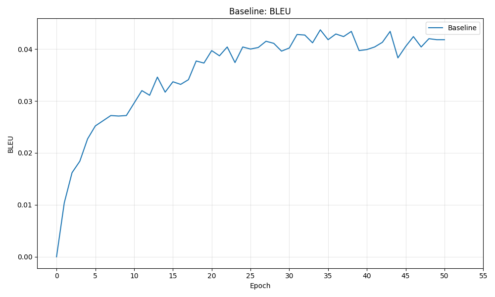
  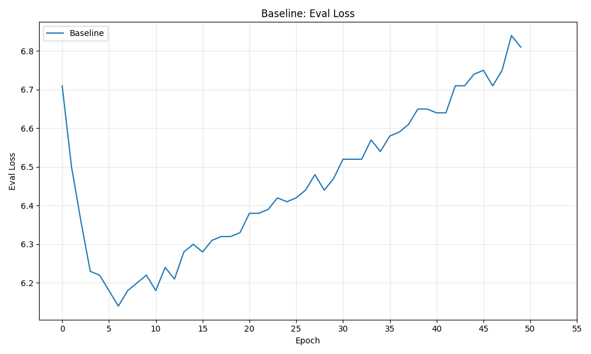
  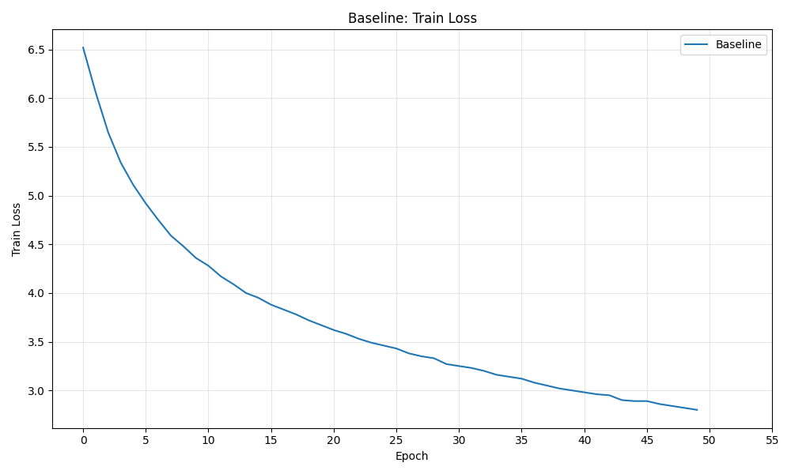
  <br>
  <em>(左) BLEU (中) 验证损失 (右) 训练损失</em>
</div>

#### 图 2: Transformer 基线学习曲线
<div align="center">
  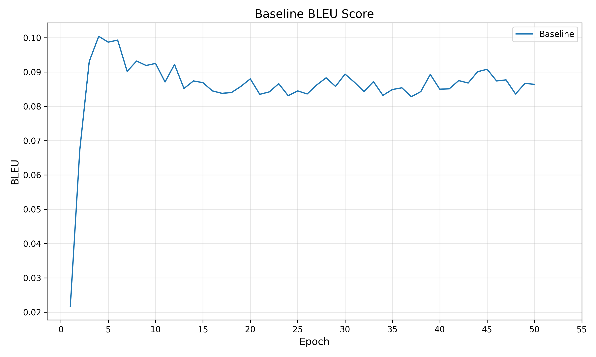
  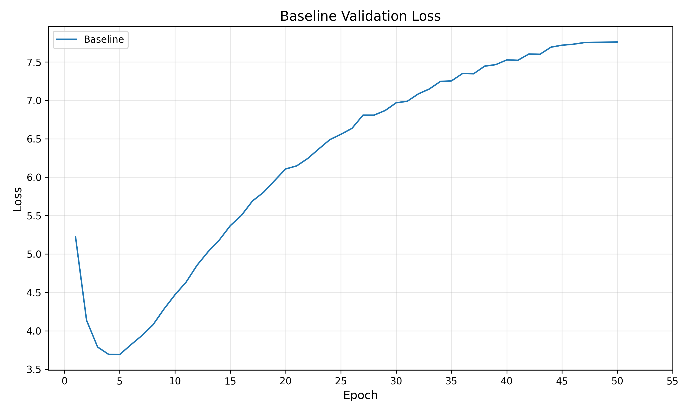
  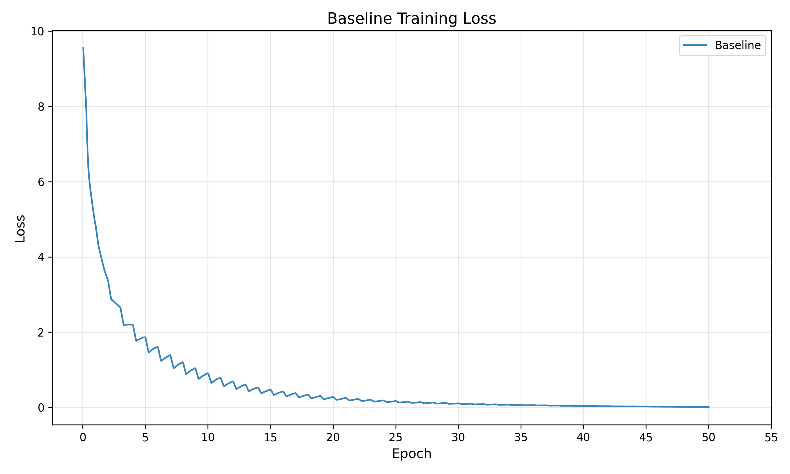
  <br>
  <em>(左) BLEU (中) 验证损失 (右) 训练损失</em>
</div>

#### 表 1: 100k 数据集上的基线模型总结
| Model | Best Train Loss | Best Val Loss | Best Val BLEU | Test BLEU | Time (h) |
| :--- | :--- | :--- | :--- | :--- | :--- |
| RNN (Attn) | 2.801 | 6.143 | 0.0437 | 0.0215 | 3.24 |
| Transformer | 0.0151 | 3.691 | 0.1004 | 0.0768 | 1.55 |

**主要观察 (Key observations):**

1.  **Transformer 提供了明显更强的基线**。在相同的数据和评估设置下，它的测试 BLEU 远高于 RNN 模型 (0.0768 vs. 0.0215)，证明了基于自注意力的架构在此翻译任务上的优势。
2.  **两个基线都表现出明显的过拟合行为**。训练损失随 epoch 稳步下降，而验证损失仅在早期阶段改善，随后恶化。然而，由于模型选择是基于最佳验证 checkpoint 而非最终 epoch，因此报告的测试结果很大程度上未受后期过拟合的影响。
3.  **RNN 基线似乎对数据分布的不匹配更为敏感**。尽管训练损失稳步下降，但其测试 BLEU 仍然很低，表明其对训练、验证和测试分布之间差异的鲁棒性有限。相比之下，Transformer 在相同条件下泛化能力更强。
4.  **Transformer 收敛效率更高**。它在大约一半的时间内完成了训练，同时获得了明显更好的 BLEU，表明其具有更有利的效率-性能权衡。

---

### 2. RNN 基线消融实验 (Ablation Study on RNN)

为了进一步分析基于 RNN 的翻译模型，我们对两个因素进行了消融研究：
(1) 注意力评分函数 (Attention Scoring Function)
(2) 训练期间使用的 Teacher Forcing (TF) 比率

所有实验均使用与基线相同的 RNN 架构、数据划分、预处理流程、最大序列长度 (128) 和优化设置。对于每种配置，选择验证性能最好的 checkpoint 进行最终评估。

#### 2.1 注意力评分函数的影响
我们比较了三种注意力机制——加性 (Additive)、点积 (Dot-product) 和乘性 (Multiplicative)，同时将 Teacher Forcing 比率固定为 0.5。图 3 显示了学习曲线，表 2 报告了定量结果。

**总体而言，三种注意力变体表现出高度相似的训练和验证动态**。加性注意力实现了略好的验证 BLEU 和更低的验证损失，但测试 BLEU 的差异微乎其微 (1.92%–2.13%)。这些结果表明，在当前设置下，注意力公式对最终翻译质量的影响有限。

#### 图 3: 不同注意力机制的 RNN 消融实验
<div align="center">
  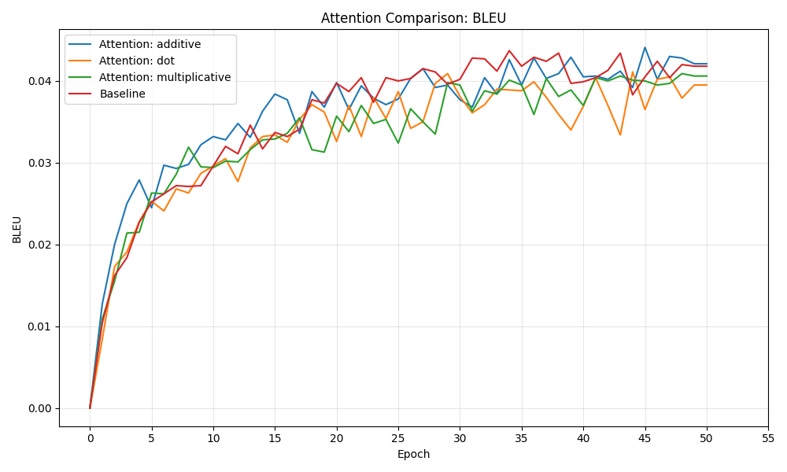
  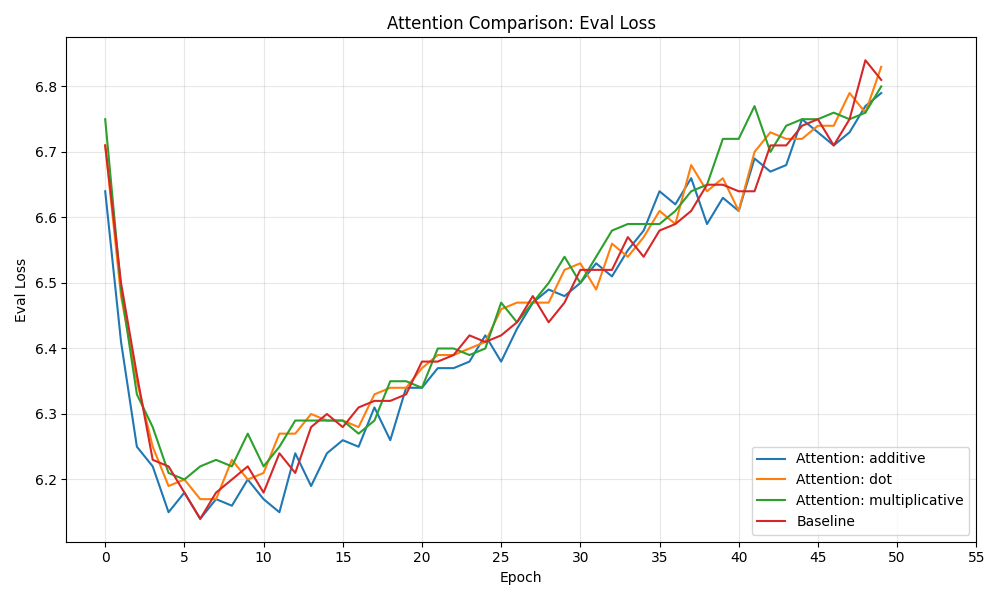
  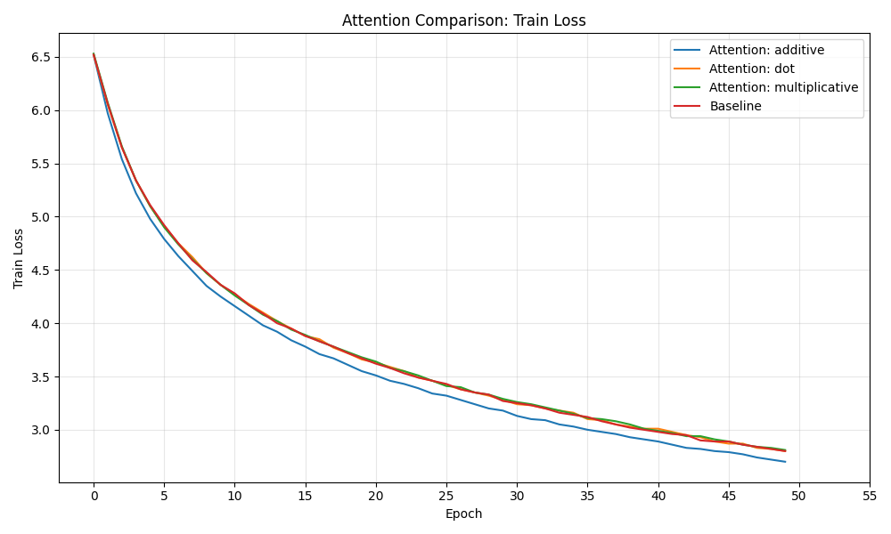
</div>

#### 2.2 Teacher Forcing 比率的影响
我们通过比较 TF 值为 0.0、0.5 和 1.0 来检查 Teacher Forcing 比率的影响，同时将注意力机制固定为点积注意力。学习曲线如图 4 所示，结果总结在表 2 中。

**Teacher Forcing 的影响远大于注意力的选择**。当 TF=0.0 时，模型实现了较低的验证损失，但 BLEU 非常差，表明自由运行的序列生成不稳定。增加 Teacher Forcing 比率持续提高了 BLEU，其中 TF=1.0 在所有 RNN 配置中实现了最高的测试 BLEU。同时，TF=1.0 导致了明显更高的验证损失，揭示了 token 级似然优化与序列级翻译质量之间的不匹配。

#### 图 4: 不同 Teacher Forcing 比率的 RNN 消融实验
<div align="center">
  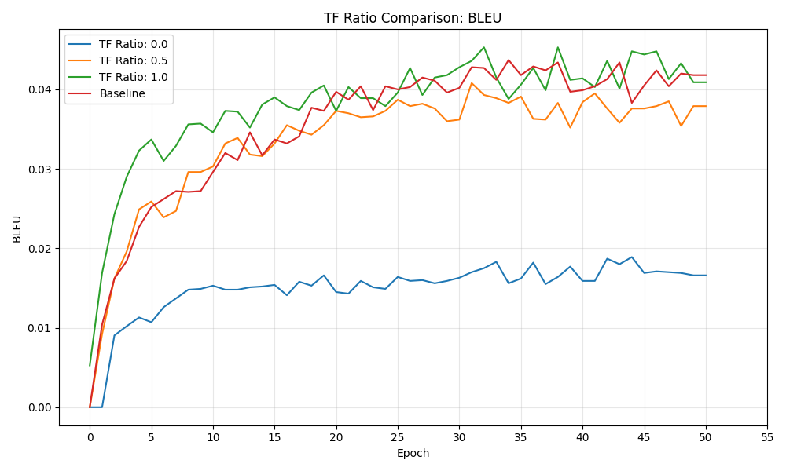
  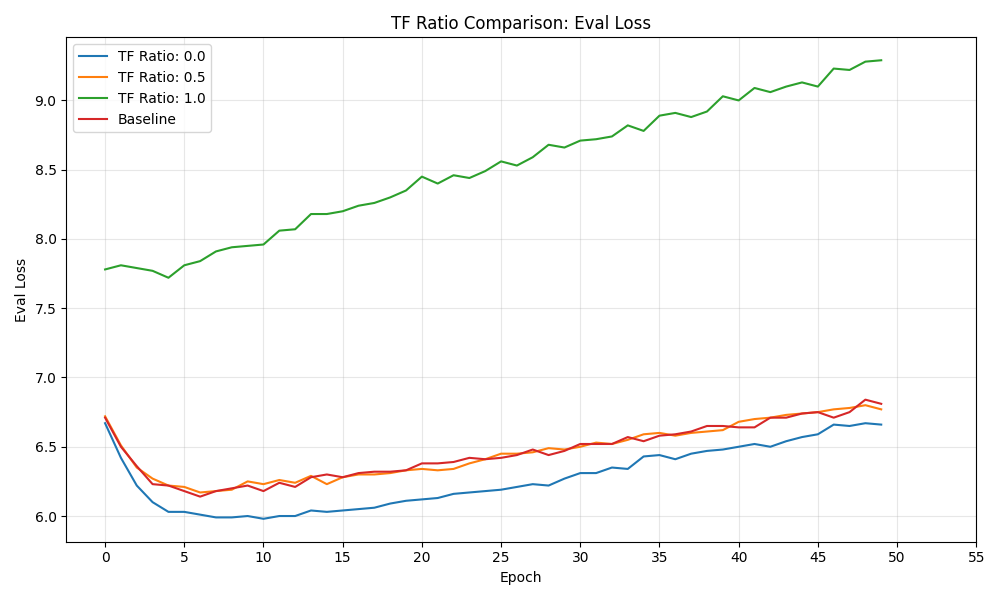
  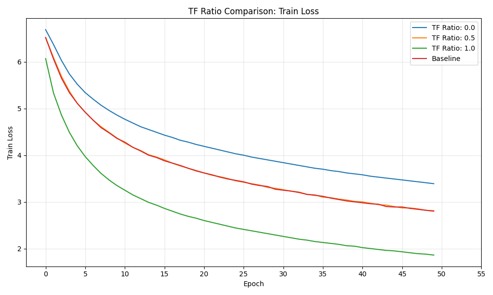
</div>

#### 表 2: RNN 消融实验结果 (使用最佳验证 Checkpoint)
| Category | Setting | Best Train Loss | Best Val Loss | Best Val BLEU | Test BLEU | Time (h) |
| :--- | :--- | :--- | :--- | :--- | :--- | :--- |
| Baseline | default | 2.801 | 6.143 | 0.0437 | 0.0215 | 3.24 |
| Attention | additive | 2.702 | 6.137 | 0.0441 | 0.0213 | 3.36 |
| Attention | dot | 2.804 | 6.169 | 0.0411 | 0.0206 | 3.40 |
| Attention | multi. | 2.807 | 6.196 | 0.0409 | 0.0192 | 3.21 |
| TF ratio | 0.0 | 3.387 | 5.980 | 0.0189 | 0.0144 | 3.32 |
| TF ratio | 0.5 | 2.809 | 6.167 | 0.0408 | 0.0222 | 3.20 |
| TF ratio | 1.0 | 1.862 | 7.721 | 0.0453 | 0.0259 | 3.22 |

**总结 (Summary):**
总的来说，注意力公式在限制 RNN 性能方面起着次要作用，而 Teacher Forcing 比率对 BLEU 和泛化行为具有主导和系统性的影响。这些结果表明，在当前设置下，训练策略而非注意力设计是 RNN 基线的主要瓶颈。

---

### 3. Transformer 基线消融实验 (Ablation Study on Transformer)

为了分析 Transformer 基线对架构选择的敏感性，我们对以下方面进行了消融研究：
(i) 归一化层 (LayerNorm vs. RMSNorm)
(ii) 位置编码方案 (Absolute vs. Relative)

所有实验均遵循与基线 Transformer 相同的训练设置。使用验证损失最好的 checkpoint 进行测试。

#### 3.1 归一化层 (Normalization Layer)
如图 5 所示，LayerNorm 和 RMSNorm 都稳定收敛并表现出相似的优化行为。然而，LayerNorm 实现了更高的测试 BLEU (0.0837 vs. 0.0790)，同时所需的训练时间略少，表明其具有更有利的质量-效率权衡。

#### 图 5: 归一化层的 Transformer 消融实验
<div align="center">
  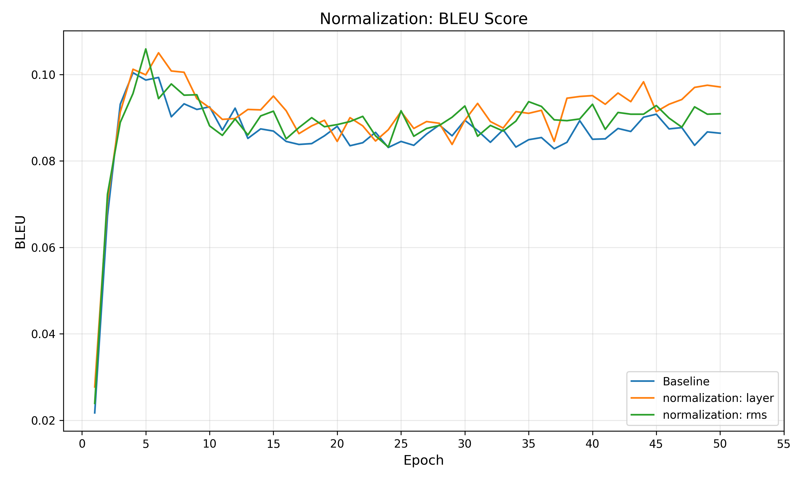
  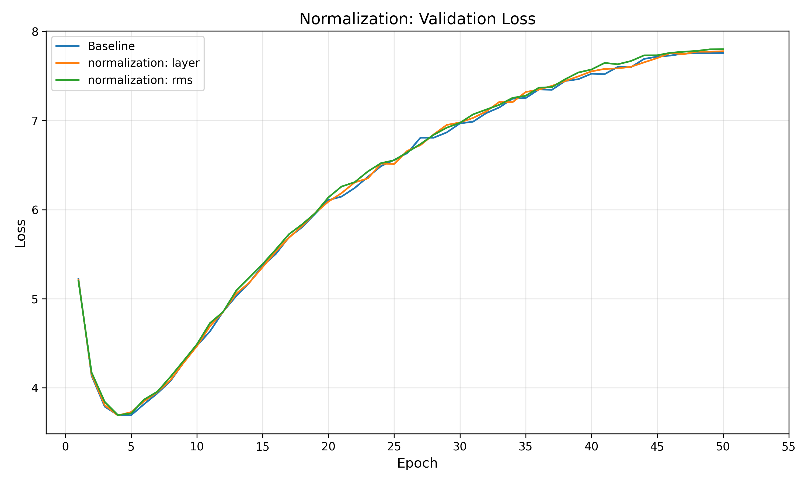
  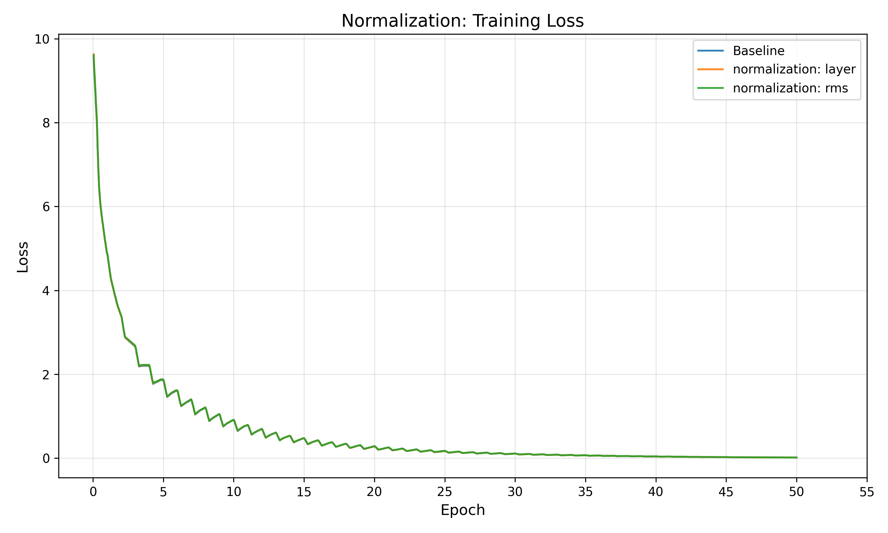
</div>

#### 3.2 位置编码 (Positional Encoding)
图 6 比较了绝对和相对位置编码。虽然相对位置编码导致略高的验证损失，但它在测试 BLEU 上实现了边际改善 (0.0780 vs. 0.0768)，突显了 token 级损失与序列级评估指标之间的不匹配。

#### 图 6: 位置编码方案的 Transformer 消融实验
<div align="center">
  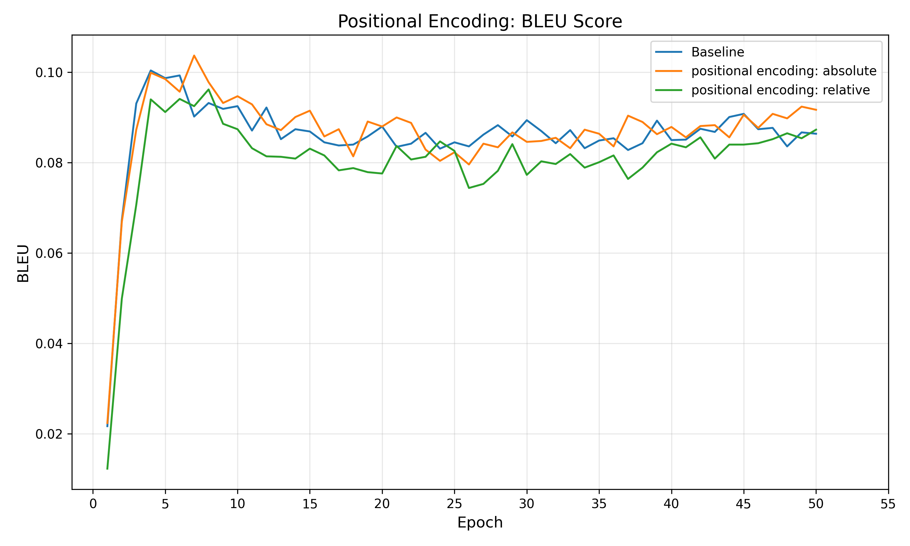
  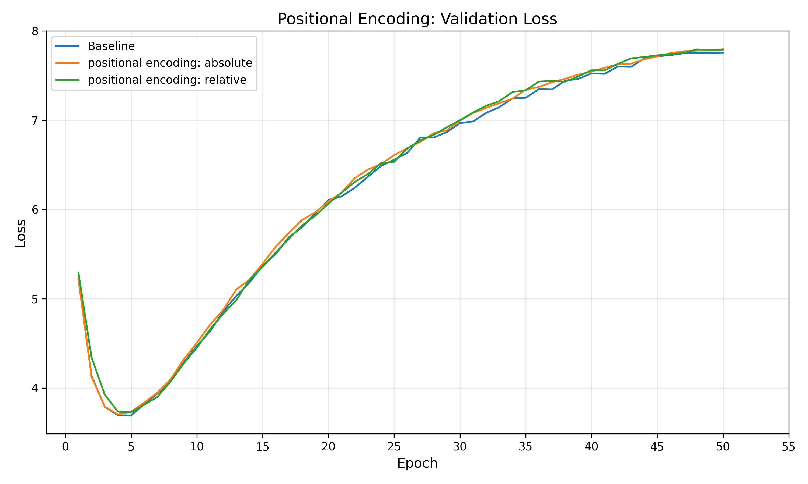
  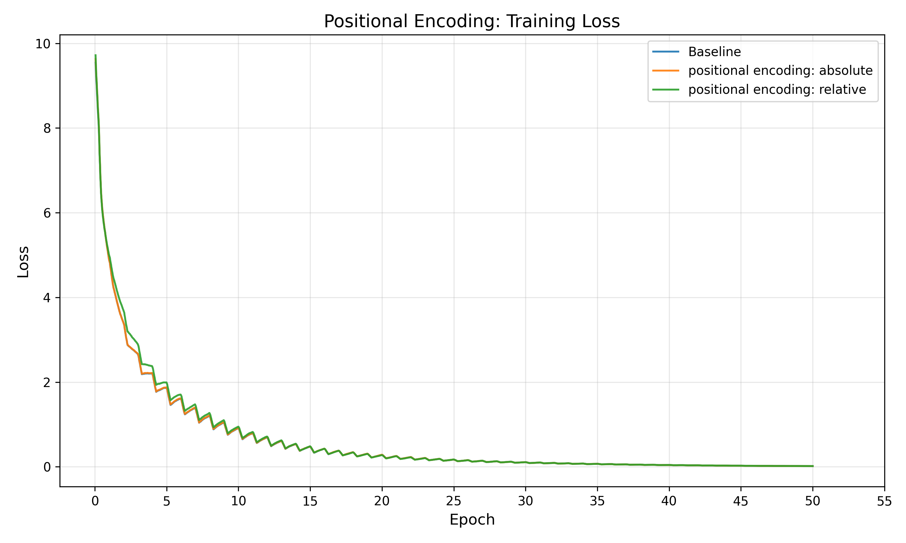
</div>

#### 3.3 优化动态 (Optimization Dynamics)
所有 Transformer 实验都采用了基于预热 (warmup) 的学习率调度，如图 7 所示。该调度使得 BLEU 在早期快速提升，并在整个训练过程中保持稳定收敛。

#### 图 7: Transformer 实验中使用的学习率调度
<div align="center">
  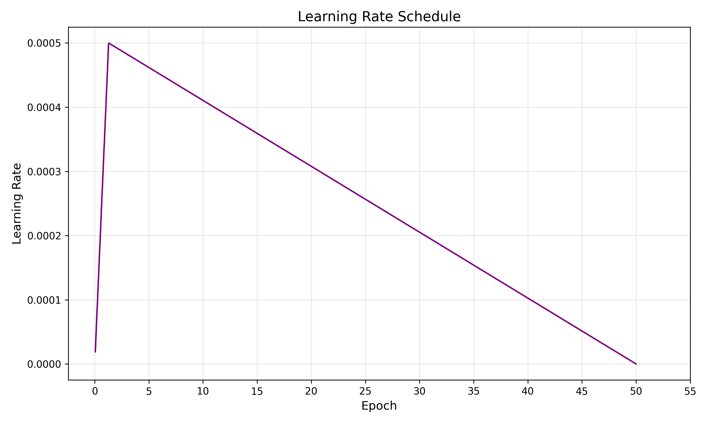
</div>

#### 表 3: Transformer 消融实验结果 (最佳验证 Checkpoint)
| Category | Setting | Best Train Loss | Best Val Loss | Test BLEU | Time (h) |
| :--- | :--- | :--- | :--- | :--- | :--- |
| Baseline | abs + LayerNorm | 0.0151 | 3.6915 | 0.0768 | 1.55 |
| Norm | LayerNorm | 0.0147 | 3.6893 | **0.0837** | 1.60 |
| Norm | RMSNorm | 0.0152 | 3.6941 | 0.0790 | 1.91 |
| PosEnc | absolute | 0.0140 | 3.7021 | 0.0768 | 1.58 |
| PosEnc | relative | 0.0156 | 3.7257 | 0.0780 | 1.92 |

**总结 (Summary):**
归一化选择对 Transformer 性能有可测量的影响，其中 LayerNorm 仍然是更可靠的选择。位置编码主要影响 BLEU 而非损失，进一步说明了 token 级目标与序列级目标之间的不匹配。总体而言，Transformer 比 RNN 基线收敛更快，并且以显著更低的训练成本实现了更高的翻译质量。

## 🛠️ 训练与复现

如果您希望重新训练模型，可以使用以下脚本：

### 训练 RNN
```bash
# 运行单个实验
python train_rnn.py --config config_rnn.json

# 或使用提供的 Shell 脚本运行一系列消融实验
bash run_rnn_experiments.sh
```

### 训练 Transformer
```bash
# 从头训练
python train_transformer.py --config config_transformer.json

# 微调 T5
python train_transformer.py --use-pretrained --model-name t5-small

# 运行消融实验
bash run_transformer_experiments.sh
```

## 📂 目录结构

```
.
├── inference.py                    # 统一推理入口脚本
├── train_rnn.py                    # RNN 训练脚本 (PyTorch Lightning)
├── train_transformer.py            # Transformer 训练脚本 (HuggingFace Trainer)
├── config.py                       # 全局配置
├── models/                         # 模型定义源码
│   ├── rnn/                        # Encoder, Decoder, Attention
│   └── transformer/                # Transformer Layers
├── utils/                          # 数据加载、预处理、评估指标工具
├── run_rnn_experiments.sh          # RNN 实验自动化脚本
├── run_transformer_experiments.sh  # Transformer 实验自动化脚本
└── EXPERIMENT_RESULTS.md           # 详细实验报告
```
